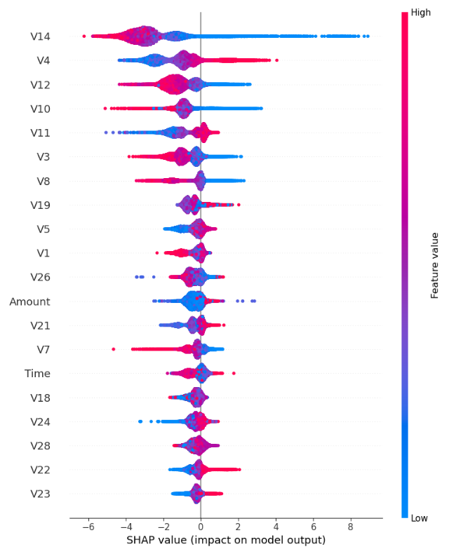
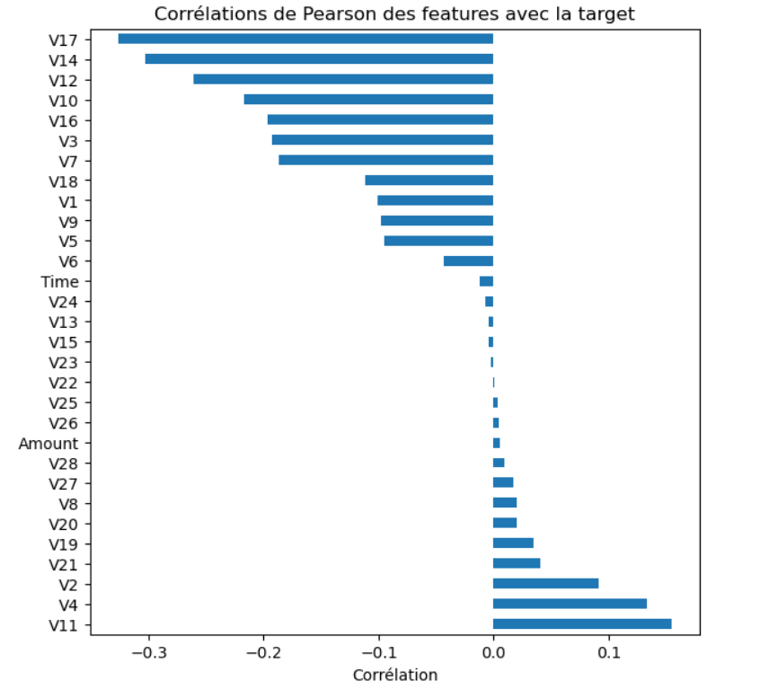
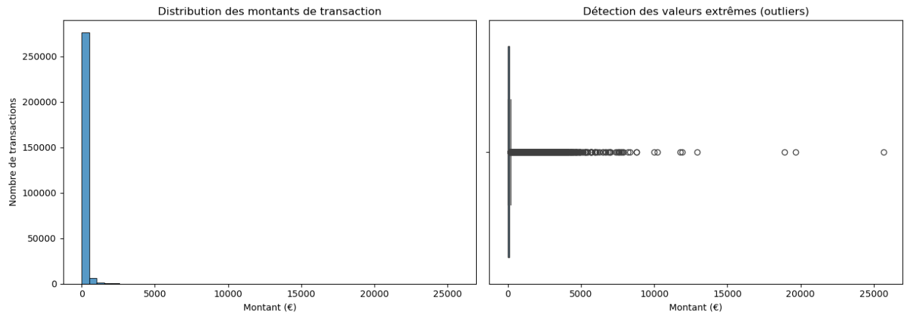
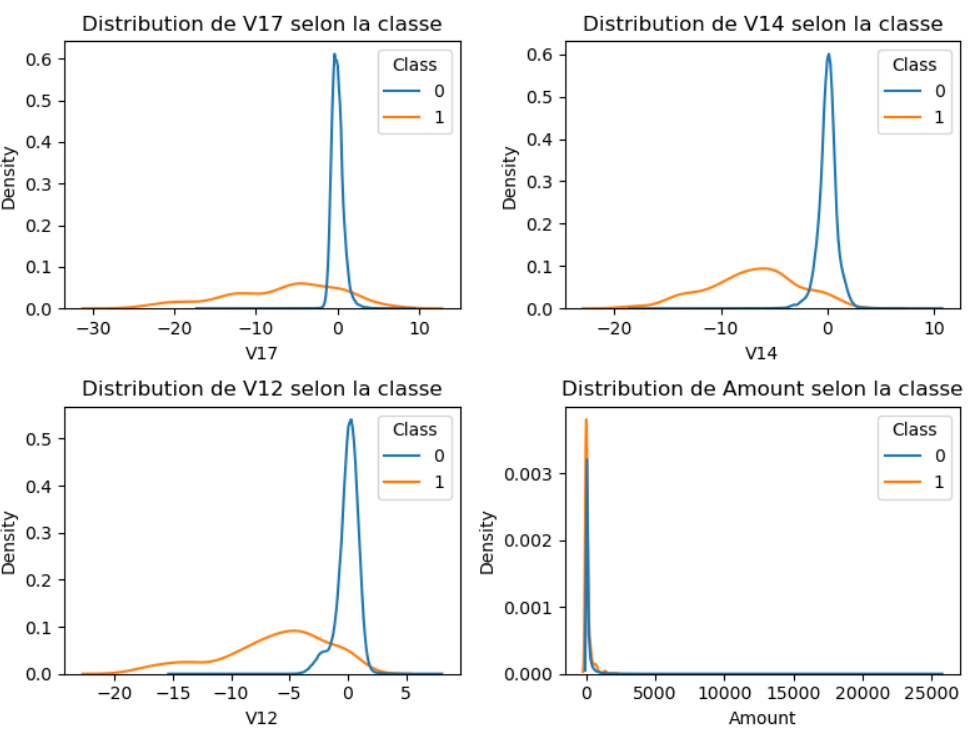

# Détection de Fraude Bancaire par Carte de Crédit

Projet de Data Science appliquant la méthodologie CRISP-DM à la détection de transactions frauduleuses, à partir du dataset public [Credit Card Fraud Detection (Kaggle)](https://www.kaggle.com/mlg-ulb/creditcardfraud).

## Contexte et objectif métier

Une banque cherche à réduire le nombre de transactions frauduleuses afin de protéger ses clients et de limiter les pertes financières et réputationnelles associées. Deux risques s'opposent :
- **Faux négatif** (fraude non détectée) : perte financière directe, remboursement client, risque réputationnel et réglementaire.
- **Faux positif** (transaction légitime bloquée à tort) : dégradation de l'expérience client, risque d'attrition.

Après analyse, un **compromis** a été retenu plutôt qu'un extrême : le recall est légèrement priorisé par rapport à la precision, sans sacrifier excessivement cette dernière.

## Données

- 284 807 transactions de porteurs de cartes européens, sur 2 jours (septembre 2013)
- 492 fraudes (0,172 %) — dataset fortement déséquilibré
- 28 variables (V1–V28) anonymisées par transformation PCA (confidentialité)
- `Time` (secondes écoulées) et `Amount` (montant en €) : seules variables non transformées
- Aucune valeur manquante

## Démarche (CRISP-DM)

### 1. Compréhension métier
L'**accuracy** est écartée comme métrique de référence : un modèle prédisant systématiquement "légitime" atteindrait 99,83 % d'accuracy tout en étant inutile. Métriques retenues : **PR-AUC** (comparaison de modèles, indépendante du seuil) et **F1 / F2-score** (évaluation opérationnelle à seuil fixé).

### 2. Exploration des données (EDA)


- Distribution des montants fortement asymétrique (moyenne 88 €, médiane 22 €, max 25 691 €) : quelques transactions extrêmes tirent la moyenne vers le haut.
- Corrélations de Pearson avec la cible : V17, V14, V12 les plus fortement corrélées (linéairement). Amount et Time quasi nulles — ce qui n'exclut pas une relation non-linéaire.
- Analyse par densité (KDE) : V17, V14, V12 séparent nettement les distributions fraude/légitime ; Amount ne discrimine quasiment pas les deux classes.
- Time selon la classe : profil bimodal (cycle jour/nuit) marqué pour les transactions légitimes, moins pour les fraudes.
- 1 081 doublons détectés (dont 19 fraudes) — supprimés pour prévenir toute fuite de données entre train et test.

### 3. Préparation des données
Ordre des opérations (critique pour éviter la fuite de données) :
1. Suppression des doublons
2. Split train/test **stratifié** (80/20)
3. Standardisation (`StandardScaler`, fit sur train uniquement)
4. Traitement du déséquilibre des classes, appliqué uniquement sur le train

### 4. Modélisation

Quatre modèles comparés :

| Modèle | PR-AUC | Recall | Precision |
|---|---|---|---|
| Régression logistique (baseline) | 0.692 | 0.58 | 0.85 |
| Régression logistique + class_weight | 0.672 | 0.87 | 0.06 |
| Random Forest + class_weight | 0.796 | 0.71 | 0.97 |
| **XGBoost + scale_pos_weight** | **0.825** | 0.78 | 0.97 |

La nette supériorité des modèles non-linéaires (Random Forest, XGBoost) confirme que la relation entre certaines variables et la fraude comporte une composante non-linéaire, cohérent avec les limites de la corrélation de Pearson identifiées en EDA.

### 5. Évaluation

Un **F2-score** (β=2) a été utilisé pour rechercher un seuil de décision priorisant le recall sans l'extrémiser. Le seuil optimal théorique (0.262) apporte un gain marginal de recall (+2 fraudes détectées) au prix d'une augmentation disproportionnée des faux positifs (×3,5, soit 5 clients légitimes supplémentaires impactés). **Le seuil par défaut (0.5) a été conservé**, ce choix illustrant un arbitrage business assumé plutôt qu'une optimisation statistique automatique.

**Modèle final : XGBoost, seuil 0.5**
- PR-AUC : **0.825**
- Recall : **0.779** (74/95 fraudes détectées)
- Precision : **0.974** (2 faux positifs sur 56 651 transactions légitimes)
- F1-score : **0.87**

### 6. Interprétabilité



Analyse SHAP (TreeExplainer) : V14, V4 et V12 sont les variables à plus fort impact sur les prédictions. Des valeurs faibles de V14 sont systématiquement associées à une probabilité de fraude plus élevée. Cette analyse documente le comportement statistique des variables, sans pouvoir en expliquer le sens métier (limite liée à la PCA).

## Limites du projet

- **PCA** : impossibilité d'expliquer une prédiction en langage métier (uniquement en poids statistiques).
- **Ancienneté des données** : entraînement sur 2 jours de données de 2013 ; risque de *data drift* (évolution des habitudes de consommation et des techniques de fraude), nécessitant un ré-entraînement régulier en conditions réelles.
- **Absence de contexte métier réel vérifiable** : les arbitrages (priorisation du recall, choix du seuil) reposent sur des hypothèses raisonnées, non validées par une organisation bancaire réelle.

## Stack technique

Python, Pandas, NumPy, Scikit-learn, XGBoost, SHAP, Matplotlib, Seaborn

## Structure du dépôt

```
credit-card-fraud-detection/
├── data/raw/              # dataset original (non versionné, voir .gitignore)
├── notebooks/             # notebook d'analyse (EDA → modélisation → évaluation)
├── reports/figures/       # graphiques exportés pour ce README
├── README.md
└── requirements.txt
```

## Auteur

Projet réalisé dans le cadre de la préparation d'une prise en poste Data Science.

## Annexe






